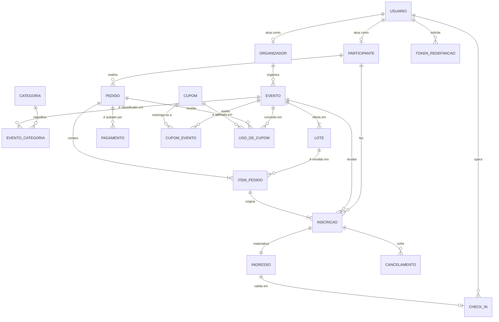

# Fase 1 — Sistema de Gestão de Eventos, Ingressos e Participantes (Ducktix)

Disciplina: Banco de Dados II — UDESC
Equipe: Bruno Werner

> Este documento acompanha o repositório do projeto. O esquema descrito aqui é
> o que está implementado: `ducktix/db/schema.sql` é o DDL executável deste
> dicionário, e `ducktix/db/backup.sql` é o backup do banco já populado.

## Onde está cada item da entrega

**Item 1 — documento de texto**

| Exigência | Seção |
|---|---|
| (a) Introdução explicativa do domínio de informação | [1](#1-introdução-ao-domínio-de-informação) |
| (b) Esquema conceitual | [2](#2-esquema-conceitual) |
| (c) Esquema lógico na forma de dicionário de dados | [3](#3-esquema-lógico-relacional--dicionário-de-dados) |
| Link do repositório | [7](#7-repositório-do-projeto) |

**Item 2 — repositório**

| Exigência | Onde |
|---|---|
| (a) Código-fonte da aplicação | `ducktix/src/` |
| (b) Backup do banco de dados | `ducktix/db/backup.sql` |
| (c) Instruções de compilação e execução | `ducktix/README.md` — resumidas na seção [6](#6-instruções-de-compilação-e-execução) |

**Requisitos da aplicação**

| Exigência | Seção | Situação |
|---|---|---|
| CRUD de todas as tabelas de entidade | [4.2](#42-crud-das-tabelas-de-entidade) | parcial — ver [8.2](#82-pendente) |
| Processo de negócio para todas as tabelas associativas | [4.3](#43-processos-de-negócio-das-tabelas-associativas) | 6 de 6 |
| Mínimo de 3 relatórios com associação de mais de uma tabela | [4.4](#44-relatórios-do-sistema) | 3 de 3 |
| Banco com dados previamente inseridos | [5](#5-banco-de-dados) | ✅ |
| Interface final não pode ser REST | [4.1](#41-interface-final) | ✅ interface gráfica |

---

## 1. Introdução ao Domínio de Informação

O domínio escolhido é a **gestão de eventos, ingressos e participantes** — um
sistema equivalente, em complexidade, a plataformas comerciais de venda de
ingressos e inscrições (ex.: Sympla, Eventbrite). O projeto, batizado
**Ducktix**, cobre o ciclo completo de vida de um evento: criação, publicação,
comercialização de ingressos, inscrição de participantes, emissão de ingressos,
check-in no dia do evento e tratamento de cancelamentos.

O domínio foi deliberadamente explorado além do trio trivial
"Evento – Participante – Ingresso", incorporando os seguintes aspectos do mundo
real:

- **Organizadores**: especialização de usuário responsável por criar e publicar
  eventos. Um organizador mantém múltiplos eventos ao longo do tempo.
- **Local do evento**: endereço em texto livre no próprio evento —
  obrigatório para eventos presenciais e híbridos, proibido para eventos 100%
  online (restrição garantida no banco).
- **Categorias**: taxonomia reutilizável (música, tecnologia, esporte…)
  associada a eventos em relação **muitos-para-muitos**, permitindo que um
  evento pertença a mais de uma categoria.
- **Modalidade e ciclo de publicação**: um evento é presencial, online ou
  híbrido, transita por estados (rascunho, publicado, encerrado, cancelado) e
  tem visibilidade própria (público ou não listado) — o que impacta a venda e a
  aparição na vitrine.
- **Lotes de ingresso**: a venda não tem preço único fixo — o evento é dividido
  em lotes (1º lote, 2º lote, Pista, Meia), cada um com preço, vagas, prazo de
  encerramento e contador de vendas controlados.
- **Pedidos e itens de pedido**: o participante realiza um pedido que pode
  conter múltiplos itens (lotes diferentes, quantidades diferentes), refletindo
  o comportamento real de um carrinho. Carrinho e compra são a mesma entidade em
  estados distintos, com **reserva temporária de 30 minutos** das vagas.
- **Pagamentos**: entidade própria, com método (cartão, Pix, boleto), status
  (pendente, aprovado, recusado, estornado) e valor — desacoplando a etapa
  financeira da emissão dos ingressos e permitindo mais de uma tentativa.
- **Cupons de desconto**: com tipo (percentual ou fixo), janela de validade,
  limite de uso e **restrição opcional a eventos específicos**. Cada aplicação
  é registrada individualmente, com o desconto rateado por evento.
- **Participantes**: quem ocupa a vaga **não precisa ter conta**. Uma pessoa
  pode comprar 3 ingressos nominais a 3 amigos diferentes, e cada um deles
  existe como participante próprio.
- **Inscrições**: o vínculo participante × evento, criado na confirmação do
  pedido — uma inscrição por unidade comprada. É a tabela central dos
  relatórios de ocupação, presença e receita.
- **Ingressos**: cada inscrição materializa um ingresso com código único, que
  vira o QR apresentado na entrada.
- **Check-in**: controle de entrada, vinculado a um ingresso específico e ao
  usuário que operou a portaria. No máximo um por ingresso.
- **Cancelamentos**: fluxo de pós-venda, com motivo, status de aprovação e
  datas de solicitação e resolução.

Regras de negócio que o modelo sustenta: um evento publicado precisa de
informações mínimas; a quantidade vendida de um lote nunca ultrapassa as vagas
(concorrência de venda resolvida com travamento de linha); o preço pago é
histórico e não muda se o lote for reajustado; um ingresso só é emitido após a
confirmação do pedido; e presença é um fato datado, distinto de estar inscrito
— quem não comparece é o *no-show*, que o relatório precisa evidenciar.

---

## 2. Esquema Conceitual

### 2.1 Diagrama Entidade-Relacionamento



### 2.2 Entidades e atributos principais

| Entidade | Atributos principais |
|---|---|
| **USUARIO** | nome, e-mail (único), senha (hash), papel, CPF/CNPJ, foto |
| **ORGANIZADOR** | nome fantasia, documento, e-mail de contato |
| **PARTICIPANTE** | nome, sobrenome, e-mail, celular, nome no crachá, LinkedIn, GitHub, empresa, segmento, cargo, nível |
| **CATEGORIA** | nome (único), slug |
| **EVENTO** | slug, nome, descrição, local, modalidade, formato online, status, visibilidade, início, término, imagem |
| **LOTE** | nome, preço, vagas, vendidos, encerra em, ordem |
| **PEDIDO** | status, criado em, reservado até, confirmado em, CPF e endereço de cobrança |
| **ITEM_PEDIDO** | quantidade, preço unitário congelado |
| **PAGAMENTO** | método, status, valor, código externo, pago em |
| **CUPOM** | código (único), tipo, valor, validade, limite, usos, ativo |
| **USO_DE_CUPOM** | desconto concedido, usado em |
| **INSCRICAO** | preço pago, status, como conheceu, inscrito em |
| **INGRESSO** | código (único), status, emitido em |
| **CHECK_IN** | realizado em, operador |
| **CANCELAMENTO** | motivo, status, solicitado em, resolvido em |

### 2.3 Cardinalidades e participação

| Relacionamento | Cardinalidade | Participação |
|---|---|---|
| ORGANIZADOR — EVENTO | 1 : N | Evento obrigatoriamente tem organizador |
| EVENTO — LOTE | 1 : N | Evento tem pelo menos um lote (total) |
| EVENTO — CATEGORIA | N : N | Via `EVENTO_CATEGORIA` |
| PARTICIPANTE — PEDIDO | 1 : N | Pedido tem um comprador |
| PEDIDO — ITEM_PEDIDO | 1 : N | Pedido confirmado tem ao menos um item |
| LOTE — ITEM_PEDIDO | 1 : N | Item aponta exatamente um lote |
| PEDIDO — PAGAMENTO | 1 : N | Pedido aberto pode ter zero pagamentos |
| ITEM_PEDIDO — INSCRICAO | 1 : N | Uma inscrição por unidade comprada |
| INSCRICAO — INGRESSO | 1 : 1 | Toda inscrição materializa um ingresso |
| INGRESSO — CHECK_IN | 1 : 0..1 | No máximo um check-in por ingresso |

### 2.4 Observações de modelagem

1. **Participante não é usuário.** São entidades separadas porque o comprador
   pode emitir ingressos nominais a terceiros sem conta no sistema.
2. **Carrinho não é entidade própria.** É o `PEDIDO` com status `aberto` —
   modelar um "carrinho" separado duplicaria itens e preços.
3. **Inscrição é a associativa central.** Ela liga participante, evento, item de
   pedido e lote, e é dela que saem os três relatórios.
4. **Cupom sem restrição vale em tudo.** Ausência de linhas em `CUPOM_EVENTO`
   significa campanha geral, evitando listar todos os eventos para dizer "todos".
5. **Relações 1:1 viram colunas, não tabelas.** Dados de cobrança pertencem ao
   pedido e dados profissionais pertencem ao participante: em ambos os casos a
   cardinalidade é 1:1 e o dado nunca é lido sem a entidade dona, então uma
   tabela à parte só acrescentaria um JOIN sem ganho de integridade.
6. **Não há cadastro de locais.** O endereço do evento é texto livre na própria
   tabela `evento` — a plataforma não reutiliza locais entre eventos.

---

## 3. Esquema Lógico Relacional — Dicionário de Dados

**SGBD:** PostgreSQL 16. **DDL executável:** `ducktix/db/schema.sql`.

Convenções: tabelas no singular em `snake_case`; PK `id` do tipo `UUID` com
`gen_random_uuid()`; valores monetários em **centavos** (`INTEGER`), nunca
ponto flutuante; datas em `TIMESTAMPTZ`; toda FK indexada.

Legenda: `PK` chave primária · `FK` chave estrangeira · `UK` única ·
`NN` não nulo · `CK` verificação · `DF` padrão.

### 3.1 `usuario`

| Coluna | Tipo | Restrições | Descrição |
|---|---|---|---|
| id | UUID | PK, DF gen_random_uuid() | Identificador |
| nome | VARCHAR(120) | NN | Nome de exibição |
| email | VARCHAR(160) | NN, UK | Login e contato |
| senha_hash | VARCHAR(255) | NN | Hash da senha |
| papel | VARCHAR(20) | NN, CK ∈ {participante, organizador} | Área de acesso |
| cpf_cnpj | VARCHAR(14) | NULL, CK length ∈ {11,14} | Só dígitos |
| foto_url | TEXT | NULL | Foto de perfil |
| criado_em | TIMESTAMPTZ | NN, DF now() | Cadastro |

### 3.2 `organizador`

| Coluna | Tipo | Restrições | Descrição |
|---|---|---|---|
| id | UUID | PK | Identificador |
| usuario_id | UUID | FK → usuario, NN, UK | Um usuário = no máx. um organizador |
| nome_fantasia | VARCHAR(140) | NN | Nome na vitrine |
| documento | VARCHAR(14) | NULL | CNPJ/CPF |
| email_contato | VARCHAR(160) | NULL | Contato público |

### 3.3 `participante`

| Coluna | Tipo | Restrições | Descrição |
|---|---|---|---|
| id | UUID | PK | Identificador |
| usuario_id | UUID | FK → usuario, NULL | Nulo quando não tem conta |
| nome | VARCHAR(80) | NN | Nome |
| sobrenome | VARCHAR(80) | NN | Sobrenome |
| email | VARCHAR(160) | NN | Contato |
| celular | VARCHAR(20) | NULL | Telefone |
| nome_cracha | VARCHAR(80) | NULL | Nome no crachá |
| linkedin / github | VARCHAR(200) | NULL | Perfis profissionais |
| empresa | VARCHAR(140) | NULL | Onde trabalha |
| segmento / cargo | VARCHAR(80) | NULL | Segmento e cargo |
| nivel | VARCHAR(40) | NULL | Experiência |

### 3.4 `token_redefinicao_senha`

| Coluna | Tipo | Restrições | Descrição |
|---|---|---|---|
| token | VARCHAR(120) | PK | Token enviado |
| usuario_id | UUID | FK → usuario, NN | Dono |
| expira_em | TIMESTAMPTZ | NN | Validade |

### 3.5 `categoria`

| Coluna | Tipo | Restrições | Descrição |
|---|---|---|---|
| id | UUID | PK | Identificador |
| nome | VARCHAR(60) | NN, UK | Nome exibido |
| slug | VARCHAR(60) | NN, UK | Identificador de URL |

### 3.6 `evento`

| Coluna | Tipo | Restrições | Descrição |
|---|---|---|---|
| id | UUID | PK | Identificador |
| organizador_id | UUID | FK → organizador, NN | Responsável |
| local | VARCHAR(160) | NULL | Endereço em texto livre; nulo se online |
| slug | VARCHAR(160) | NN, UK | URL pública; não muda ao renomear |
| nome | VARCHAR(140) | NN | Título |
| descricao | TEXT | NN | HTML sanitizado |
| modalidade | VARCHAR(12) | NN, CK ∈ {presencial, online, hibrido} | Como acontece |
| formato_online | VARCHAR(20) | NULL, CK ∈ {ao-vivo, videoconferencia, desafio-virtual, conteudo-digital} | Só online/híbrido |
| status | VARCHAR(12) | NN, DF 'rascunho', CK ∈ {rascunho, publicado, encerrado, cancelado} | Publicação |
| visibilidade | VARCHAR(12) | NN, DF 'publico', CK ∈ {publico, nao-listado} | Listagem |
| comeca_em | TIMESTAMPTZ | NN | Início |
| termina_em | TIMESTAMPTZ | NN, CK > comeca_em | Término |
| imagem_url | TEXT | NULL | Banner |
| criado_em | TIMESTAMPTZ | NN, DF now() | Criação |

**CK compostas:** `modalidade='online'` ⇒ `local IS NULL`;
`modalidade<>'online'` ⇒ `local IS NOT NULL`;
`modalidade<>'presencial'` ⇒ `formato_online IS NOT NULL`.

### 3.7 `evento_categoria` *(associativa)*

| Coluna | Tipo | Restrições | Descrição |
|---|---|---|---|
| evento_id | UUID | PK, FK → evento | Evento |
| categoria_id | UUID | PK, FK → categoria | Categoria |

**Processo de negócio:** classificar evento.

### 3.8 `lote`

| Coluna | Tipo | Restrições | Descrição |
|---|---|---|---|
| id | UUID | PK | Identificador |
| evento_id | UUID | FK → evento CASCADE, NN | Evento dono |
| nome | VARCHAR(60) | NN | "Lote 1", "Pista" |
| preco_centavos | INTEGER | NN, CK ≥ 0 | 0 = gratuito |
| vagas | INTEGER | NN, CK > 0 | Ofertadas |
| vendidos | INTEGER | NN, DF 0, CK ≥ 0 | Contador |
| encerra_em | TIMESTAMPTZ | NULL | Prazo |
| ordem | SMALLINT | NN, DF 0 | Exibição |
| — | — | **CK vendidos ≤ vagas** | Invariante da venda |
| — | — | UK (evento_id, nome) | Nome único no evento |

### 3.9 `pedido`

| Coluna | Tipo | Restrições | Descrição |
|---|---|---|---|
| id | UUID | PK | Identificador |
| comprador_id | UUID | FK → usuario, NN | Quem paga |
| status | VARCHAR(12) | NN, DF 'aberto', CK ∈ {aberto, confirmado, cancelado} | Estado |
| criado_em | TIMESTAMPTZ | NN, DF now() | Criação |
| reservado_ate | TIMESTAMPTZ | NULL | Reserva de 30 min |
| confirmado_em | TIMESTAMPTZ | NULL | Confirmação |
| cobranca_cpf | VARCHAR(11) | NULL | CPF do comprador |
| cobranca_cep | VARCHAR(8) | NULL | Só dígitos |
| cobranca_logradouro | VARCHAR(160) | NULL | Rua |
| cobranca_numero / _complemento | VARCHAR(20) / (80) | NULL | Endereço |
| cobranca_bairro | VARCHAR(80) | NULL | Bairro |
| cobranca_cidade | VARCHAR(80) | NULL | Cidade |
| cobranca_uf | CHAR(2) | NULL | UF |
| — | — | CK obrigatória se `status='confirmado'` | Carrinho pode não ter; compra não |

### 3.10 `item_pedido` *(associativa)*

| Coluna | Tipo | Restrições | Descrição |
|---|---|---|---|
| id | UUID | PK | Identificador |
| pedido_id | UUID | FK → pedido CASCADE, NN | Pedido |
| lote_id | UUID | FK → lote, NN | Lote comprado |
| quantidade | INTEGER | NN, CK > 0 | Unidades |
| preco_unitario_centavos | INTEGER | NN, CK ≥ 0 | **Preço congelado** |
| — | — | UK (pedido_id, lote_id) | Não duplica lote |

**Processo de negócio:** adicionar ao carrinho.

### 3.11 `pagamento`

| Coluna | Tipo | Restrições | Descrição |
|---|---|---|---|
| id | UUID | PK | Identificador |
| pedido_id | UUID | FK → pedido CASCADE, NN | Pedido |
| metodo | VARCHAR(10) | NN, CK ∈ {cartao, pix, boleto} | Instrumento |
| status | VARCHAR(12) | NN, DF 'pendente', CK ∈ {pendente, aprovado, recusado, estornado} | Estado |
| valor_centavos | INTEGER | NN, CK ≥ 0 | Valor cobrado |
| codigo_externo | VARCHAR(200) | NULL | Pix / linha digitável |
| criado_em | TIMESTAMPTZ | NN, DF now() | Geração |
| pago_em | TIMESTAMPTZ | NULL | Compensação |

### 3.12 `cupom`

| Coluna | Tipo | Restrições | Descrição |
|---|---|---|---|
| id | UUID | PK | Identificador |
| codigo | VARCHAR(24) | NN, UK | Código no checkout |
| tipo_desconto | VARCHAR(12) | NN, CK ∈ {percentual, fixo} | Natureza |
| valor | INTEGER | NN, CK > 0 | 1–100 (%) ou centavos |
| valido_de | TIMESTAMPTZ | NN | Início |
| valido_ate | TIMESTAMPTZ | NN, CK > valido_de | Fim |
| limite_uso | INTEGER | NN, CK > 0 | Teto |
| usos | INTEGER | NN, DF 0, CK usos ≤ limite_uso | Contador |
| ativo | BOOLEAN | NN, DF true | Desativação manual |
| criado_em | TIMESTAMPTZ | NN, DF now() | Criação |
| — | — | CK percentual ⇒ valor ≤ 100 | Não passa de 100% |

### 3.13 `cupom_evento` *(associativa)*

| Coluna | Tipo | Restrições | Descrição |
|---|---|---|---|
| cupom_id | UUID | PK, FK → cupom CASCADE | Cupom |
| evento_id | UUID | PK, FK → evento CASCADE | Evento em que vale |

**Processo de negócio:** restringir campanha por vínculo explícito em
`cupom_evento`. O mesmo código pode existir em eventos diferentes.

### 3.14 `uso_de_cupom` *(associativa)*

| Coluna | Tipo | Restrições | Descrição |
|---|---|---|---|
| id | UUID | PK | Identificador |
| cupom_id | UUID | FK → cupom, NN | Cupom |
| pedido_id | UUID | FK → pedido CASCADE, NN | Pedido |
| evento_id | UUID | FK → evento, NN | Evento do rateio |
| desconto_centavos | INTEGER | NN, CK ≥ 0 | Concedido |
| usado_em | TIMESTAMPTZ | NN, DF now() | Momento |
| — | — | UK (cupom_id, pedido_id, evento_id) | Uma linha por trio |

**Processo de negócio:** aplicar cupom, com desconto rateado por evento.

### 3.15 `inscricao` *(associativa)*

| Coluna | Tipo | Restrições | Descrição |
|---|---|---|---|
| id | UUID | PK | Identificador |
| evento_id | UUID | FK → evento, NN | Evento |
| participante_id | UUID | FK → participante, NN | Quem ocupa a vaga |
| item_pedido_id | UUID | FK → item_pedido CASCADE, NN | Item que originou |
| lote_id | UUID | FK → lote, NN | Lote comprado |
| preco_pago_centavos | INTEGER | NN, CK ≥ 0 | Valor da vaga |
| status | VARCHAR(12) | NN, DF 'ativa', CK ∈ {ativa, cancelada} | Estado |
| como_conheceu | VARCHAR(120) | NULL | Origem declarada |
| inscrito_em | TIMESTAMPTZ | NN, DF now() | Data |
| — | — | UK (evento_id, participante_id, item_pedido_id) | Sem duplicata |

**Processo de negócio:** emitir ingresso / inscrever participante.

### 3.16 `ingresso`

| Coluna | Tipo | Restrições | Descrição |
|---|---|---|---|
| id | UUID | PK | Identificador |
| inscricao_id | UUID | FK → inscricao CASCADE, NN, UK | 1:1 |
| codigo | VARCHAR(64) | NN, UK | Conteúdo do QR |
| status | VARCHAR(12) | NN, DF 'emitido', CK ∈ {emitido, utilizado, cancelado} | Estado |
| emitido_em | TIMESTAMPTZ | NN, DF now() | Emissão |

### 3.17 `check_in` *(associativa)*

| Coluna | Tipo | Restrições | Descrição |
|---|---|---|---|
| id | UUID | PK | Identificador |
| ingresso_id | UUID | FK → ingresso CASCADE, NN, UK | Ingresso validado |
| operador_id | UUID | FK → usuario, NULL | Quem operou |
| realizado_em | TIMESTAMPTZ | NN, DF now() | Entrada |

**Processo de negócio:** realizar check-in. O `UNIQUE` garante uma entrada por ingresso.

### 3.18 `cancelamento_de_inscricao`

| Coluna | Tipo | Restrições | Descrição |
|---|---|---|---|
| id | UUID | PK | Identificador |
| inscricao_id | UUID | FK → inscricao CASCADE, NN | Inscrição |
| motivo | VARCHAR(200) | NULL | Justificativa |
| status | VARCHAR(12) | NN, DF 'solicitado', CK ∈ {solicitado, aprovado, negado} | Trâmite |
| solicitado_em | TIMESTAMPTZ | NN, DF now() | Abertura |
| resolvido_em | TIMESTAMPTZ | NULL | Fechamento |

### 3.19 Entidades vs. associativas

| Tipo | Tabelas |
|---|---|
| **Entidade** (CRUD completo) | `usuario`, `organizador`, `participante`, `token_redefinicao_senha`, `categoria`, `evento`, `lote`, `pedido`, `pagamento`, `cupom`, `ingresso`, `cancelamento_de_inscricao` |
| **Associativa** (processo de negócio) | `evento_categoria`, `item_pedido`, `cupom_evento`, `uso_de_cupom`, `inscricao`, `check_in` |

### 3.20 Normalização

O esquema está na **3ª Forma Normal**:

- **1FN** — atributos atômicos: endereço de cobrança decomposto em colunas;
  lotes em tabela própria (não lista dentro do evento); categorias via
  associativa (não coluna multivalorada).
- **2FN** — sem dependência parcial: as associativas de chave composta
  (`evento_categoria`, `cupom_evento`) só contêm as chaves; as demais usam chave
  substituta com `UNIQUE` declarado à parte.
- **3FN** — sem dependência transitiva: `evento` guarda `organizador_id` e as
  categorias por FK, não os nomes; `inscricao` não repete dados do participante.
  Relações 1:1 (cobrança no pedido, dados profissionais no participante) são
  colunas da própria entidade: dependem só da chave, sem transitividade.

**Denormalizações deliberadas**, cada uma justificada:

| Coluna | Motivo |
|---|---|
| `lote.vendidos` | Contador materializado — é a linha travada (`SELECT … FOR UPDATE`) na transação de venda. Recalcular por `COUNT` a cada leitura de vitrine seria caro. |
| `cupom.usos` | Idem: o teto é verificado a cada aplicação. |
| `item_pedido.preco_unitario_centavos` | **Não é redundância** — é fato temporal. Reajuste do lote não altera pedido antigo. |
| `inscricao.lote_id`, `inscricao.preco_pago_centavos` | Alcançáveis via `item_pedido`, mas presentes para evitar dois JOINs em tabela de milhões de linhas nos relatórios. |

### 3.21 Índices

`idx_evento_status_comeca`, `idx_evento_organizador`,
`idx_lote_evento`, `idx_pedido_comprador`, `idx_item_pedido_pedido`,
`idx_item_pedido_lote`, `idx_pagamento_pedido`, `idx_inscricao_evento`,
`idx_inscricao_participante`, `idx_inscricao_lote`, `idx_ingresso_codigo`,
`idx_check_in_ingresso`, `idx_uso_cupom_cupom`, `idx_uso_cupom_evento`,
`idx_evento_categoria_cat`.

---

## 4. A Aplicação

### 4.1 Interface final

A interface final é uma **aplicação web com interface gráfica**, construída em
Next.js (App Router) + TypeScript. As operações de escrita são executadas por
**Server Actions** — funções que rodam no servidor e são invocadas diretamente
pelos formulários da interface.

> [!important] Sobre a exigência "REST não será aceito como interface final"
> O sistema **não expõe uma API REST como interface final**. A interface é a
> própria aplicação gráfica, e a camada de aplicação
> (`src/server/*/application/`) é chamada diretamente pelas Server Actions. A
> rota HTTP existente em `src/app/api/uploads` é apenas um adaptador auxiliar
> para upload de arquivos.

A arquitetura em camadas isola o domínio da infraestrutura:

```
domain/            regras de negócio puras (sem SQL, HTTP ou React)
application/       casos de uso — orquestram domínio + ports
ports/             interfaces de repositório
infrastructure/    implementações concretas
```

É essa separação que torna a Fase 2 (NoSQL) uma troca de `infrastructure/`,
sem reescrever regra de negócio.

### 4.2 CRUD das tabelas de entidade

O enunciado define CRUD como **cadastro, consulta, atualização e remoção**. A
matriz abaixo declara a situação de cada uma das 12 tabelas de entidade.

| # | Tabela | C | R | U | D | Onde na aplicação |
|---|---|:--:|:--:|:--:|:--:|---|
| 1 | `usuario` | ✅ | ✅ | ✅ | ⬜ | `/register`, `/login`, `/account` |
| 2 | `evento` | ✅ | ✅ | ✅ | ⬜ | `/organizer/events/new`, `/organizer/events`, `/organizer/events/{id}/edit` |
| 3 | `cupom` | ✅ | ✅ | ✅ | ⬜ | `/organizer/coupons`, `/organizer/coupons/new`, `/organizer/coupons/{id}` |
| 4 | `pedido` | ✅ | ✅ | ✅ | ⬜ | carrinho → `/checkout/{id}` → confirmação |
| 5 | `lote` | ✅ | ✅ | ⬜ | ⬜ | criado no passo 3 do assistente de evento |
| 6 | `ingresso` | ✅ | ✅ | ⬜ | ⬜ | emitido na confirmação; `/my-tickets` |
| 7 | `token_redefinicao_senha` | ✅ | ✅ | — | ✅ | `/forgot-password`, `/reset-password` (entidade interna, sem UI de gestão) |
| 8 | `participante` | ✅ | ✅ | ⬜ | ⬜ | criado no checkout; listado em `/organizer/events/{id}` |
| 9 | `categoria` | ⬜ | ✅ | ⬜ | ⬜ | consumida na criação de evento; **sem tela de cadastro** |
| 10 | `organizador` | ⬜ | ✅ | ⬜ | ⬜ | **sem tela de cadastro** |
| 11 | `pagamento` | ✅ | ✅ | — | — | criado e consultado na confirmação do pedido |
| 12 | `cancelamento_de_inscricao` | ⬜ | ⬜ | ⬜ | ⬜ | sem tela específica na entrega |

✅ implementado · ⬜ pendente · — não se aplica

> [!warning] Situação declarada honestamente
> A aplicação **ainda não cobre o CRUD completo de todas as tabelas de
> entidade**. Faltam, principalmente, as operações de **remoção** e as telas de
> cadastro de `categoria`, `organizador`, `pagamento` e
> `cancelamento_de_inscricao`. A seção 8 lista as pendências.

### 4.3 Processos de negócio das tabelas associativas

Cada uma das 6 tabelas associativas tem um processo de negócio próprio — não um
CRUD genérico.

| # | Associativa | Relaciona | Processo de negócio | Situação | Onde |
|---|---|---|---|:--:|---|
| 1 | `item_pedido` | pedido × lote | **Adicionar ao carrinho** — valida se o lote está aberto, congela o preço unitário e abre a reserva de 30 min | ✅ | `/events/{slug}` |
| 2 | `inscricao` | participante × evento × item de pedido | **Emitir ingresso** — na confirmação, cria uma inscrição por unidade comprada, nominal ao participante informado, e debita as vagas do lote | ✅ | `/checkout/{id}/payment` |
| 3 | `uso_de_cupom` | cupom × pedido × evento | **Aplicar cupom** — valida janela, limite e restrição por evento; no fechamento rateia o desconto entre os eventos do pedido | ✅ | `/checkout/{id}` |
| 4 | `cupom_evento` | cupom × evento | **Restringir campanha** — limita um código a eventos específicos | ✅ | `/organizer/coupons/new` |
| 5 | `evento_categoria` | evento × categoria | **Classificar evento** — define em que trilhas da vitrine o evento aparece | ✅ | assistente de criação e filtros da vitrine |
| 6 | `check_in` | ingresso × usuário operador | **Realizar check-in** — valida que o ingresso está emitido, é do evento certo e ainda não foi usado; então marca presença | ✅ | `/organizer/events/{id}/check-in` |

✅ implementado · 🟡 parcial · ⬜ pendente

Detalhamento dos processos implementados:

**Adicionar ao carrinho** (`src/server/ticketing/application/carrinho.ts`)
Localiza ou cria o pedido aberto do participante, valida `loteEstaAberto`,
congela `preco_unitario_centavos` e grava a reserva. Um pedido aberto com
reserva vencida é cancelado e um novo é criado.

**Emitir ingresso** (`src/server/ticketing/application/checkout.ts`)
Numa única transação lógica: registra a venda em cada lote (incrementa
`vendidos`), cria uma `inscricao` por unidade e emite o `ingresso`
correspondente. A restrição `CHECK (vendidos <= vagas)` é a garantia final de
que a concorrência não vende a mesma vaga duas vezes.

**Aplicar cupom** (`aplicarCupom` / `confirmarPedido`)
Valida validade, limite de uso e `cupomValeParaEvento`. Na confirmação grava uma
linha em `uso_de_cupom` por evento do pedido, com o desconto rateado pelo peso
de cada evento no total.

### 4.4 Relatórios do sistema

Os três relatórios exigidos, cada um cruzando mais de uma tabela.
Implementados em `src/server/event/application/relatorios.ts` e disponíveis em
`/organizer/reports/events`.

| # | Relatório | Tabelas cruzadas | Métricas |
|---|---|---|---|
| 1 | **Eventos e participantes** | `evento` × `inscricao` × `ingresso` × `check_in` | inscritos, presentes, taxa de presença, ocupação |
| 2 | **Vendas de ingressos** | `evento` × `lote` × `item_pedido` × `pedido` | vendidos, vagas, ocupação, receita, ticket médio |
| 3 | **Cupons e descontos** | `cupom` × `uso_de_cupom` × `pedido` × `evento` | usos, aproveitamento do limite, desconto concedido, eventos alcançados |

**Relatório 1 em SQL:**

```sql
SELECT e.nome,
       count(*) FILTER (WHERE i.status = 'ativa')                        AS inscritos,
       count(ci.id)                                                      AS presentes,
       round(100.0 * count(ci.id)
             / NULLIF(count(*) FILTER (WHERE i.status = 'ativa'), 0), 0) AS presenca_pct
FROM evento e
JOIN      inscricao i  ON i.evento_id    = e.id
JOIN      ingresso  g  ON g.inscricao_id = i.id
LEFT JOIN check_in  ci ON ci.ingresso_id = g.id
GROUP BY e.id, e.nome
ORDER BY presentes DESC;
```

**Relatório 2 em SQL:**

```sql
SELECT e.nome, l.nome AS lote, l.vendidos, l.vagas,
       round(100.0 * l.vendidos / l.vagas, 0)      AS ocupacao_pct,
       (l.vendidos * l.preco_centavos) / 100.0     AS receita
FROM evento e
JOIN lote l ON l.evento_id = e.id
ORDER BY l.vendidos * l.preco_centavos DESC;
```

**Relatório 3 em SQL:**

```sql
SELECT c.codigo, c.tipo_desconto, c.usos, c.limite_uso,
       count(DISTINCT u.evento_id)               AS eventos_alcancados,
       coalesce(sum(u.desconto_centavos), 0)/100.0 AS desconto_concedido
FROM cupom c
LEFT JOIN uso_de_cupom u ON u.cupom_id = c.id
GROUP BY c.id, c.codigo, c.tipo_desconto, c.usos, c.limite_uso
ORDER BY c.usos DESC;
```

---

## 5. Banco de Dados

O banco acompanha o repositório **com dados previamente inseridos**, conforme
exigido.

| Tabela | Registros |
|---|---|
| usuario | 29 |
| organizador | 28 |
| participante | 9.111 |
| categoria | 13 |
| evento | 30 |
| evento_categoria | 30 |
| lote | 39 |
| pedido | 3.643 |
| item_pedido | 3.645 |
| pagamento | 3.643 |
| cupom | 4 |
| cupom_evento | 3 |
| inscricao | 9.111 (8.864 ativas, 247 canceladas) |
| ingresso | 9.111 |
| check_in | 4.779 |

Receita total representada: **R$ 730.715,00** · Taxa de presença média: **84%**
nos 16 eventos já realizados.

> Todos os dados são **sintéticos**. Nenhuma pessoa, organizador ou evento
> existe; os e-mails usam o domínio `example.com`, reservado pela RFC 2606 e
> não entregável.

### 5.1 Arquivos

| Arquivo | Conteúdo |
|---|---|
| `ducktix/db/schema.sql` | DDL do esquema — versão executável do dicionário da seção 3 |
| `ducktix/db/seed.sql` | Carga dos dados de demonstração |
| `ducktix/db/backup.sql` | **Backup do banco** (`pg_dump`), item 2(b) da entrega |
| `ducktix/db/gerar-seed.mjs` | Gerador do `seed.sql` a partir da fixture da aplicação |

O `seed.sql` é **gerado**, não escrito à mão: ele deriva da mesma fixture que
alimenta a aplicação, de forma determinística. Por isso os números do banco são
exatamente os que aparecem nas telas do sistema.

---

## 6. Instruções de Compilação e Execução

Instruções completas em `ducktix/README.md` (item 2(c) da entrega). Resumo:

### 6.1 Requisitos

Node.js 20+, npm 10+, PostgreSQL 16+.

### 6.2 Banco de dados

```bash
createdb ducktix
psql -d ducktix -f ducktix/db/schema.sql
psql -d ducktix -f ducktix/db/seed.sql
```

Ou, restaurando o backup diretamente:

```bash
createdb ducktix
psql -d ducktix -f ducktix/db/backup.sql
```

Conferência:

```bash
psql -d ducktix -c "
SELECT 'eventos', count(*)::text FROM evento
UNION ALL SELECT 'inscrições ativas', count(*)::text FROM inscricao WHERE status='ativa'
UNION ALL SELECT 'check-ins', count(*)::text FROM check_in;"
```

Esperado: **30 eventos, 8.864 inscrições ativas, 4.779 check-ins**.

### 6.3 Aplicação

```bash
cd ducktix
npm install
npm run dev      # desenvolvimento, em http://localhost:3000
```

```bash
npm run build    # build de produção
npm run start
```

### 6.4 Roteiro de demonstração

**Participante (vitrine):** `/events` → escolher evento → selecionar lote →
`/checkout/{id}` (dados dos participantes, cupom `PROMO10`, cobrança, método) →
`/checkout/{id}/payment` (QR do Pix ou boleto) → `/my-tickets` (QR de entrada).

**Organizador (back-office):** `/organizer` (indicadores) →
`/organizer/events` (lista com ocupação e receita) →
`/organizer/events/{id}` (curva de vendas, lotes, lista nominal de
participantes com status de check-in) → `/organizer/events/{id}/edit` →
`/organizer/coupons` (cadastro e uso por evento) →
`/organizer/reports/events` (os três relatórios).

---

## 7. Repositório do Projeto

**Link:** *(inserir aqui a URL pública do repositório antes da entrega)*

Conforme o item 2 do enunciado, o repositório contém:

| Item exigido | Onde está |
|---|---|
| (a) Código-fonte da aplicação | `ducktix/src/` |
| (b) Backup do banco de dados | `ducktix/db/backup.sql` |
| (c) Instruções de compilação e execução | `ducktix/README.md` |

Nenhum arquivo está compactado. O link deve permanecer público e sem alterações
após a defesa.

---

## 8. Situação da Implementação

Declaração honesta do que está pronto e do que falta, para que a avaliação
possa ser feita sobre o estado real do sistema.

### 8.1 Completo

- Esquema conceitual e lógico normalizado (3FN), com dicionário de dados.
- Banco PostgreSQL criado, populado e com backup — validado por restauração
  em base limpa.
- Regras de negócio garantidas por `CHECK`/`UNIQUE` no banco, não apenas em
  código: estoque do lote, coerência entre modalidade e local, cobrança
  obrigatória em pedido confirmado, teto de uso de cupom, um check-in por
  ingresso.
- 6 de 6 processos de negócio das tabelas associativas.
- Os 3 relatórios exigidos, com interface e SQL equivalente.
- Interface gráfica completa da vitrine e do back-office.

### 8.2 Pendente

| Pendência | Impacto na avaliação |
|---|---|
| **Operações de remoção (Delete)** em todas as entidades | O enunciado define CRUD incluindo remoção |
| **CRUD de `categoria`** | Tabela de entidade sem tela de cadastro |
| **CRUD de `organizador`** | Tabela de entidade sem tela de cadastro |
| **`cancelamento_de_inscricao`** | Existe no banco; sem fluxo na aplicação |
| **CRUD completo de remoção** | Algumas entidades só podem ser alteradas por processos de negócio, para preservar integridade histórica |

O detalhamento técnico dessas pendências está em
`ducktix/docs/modelo-mudancas.md`, seção 7.
