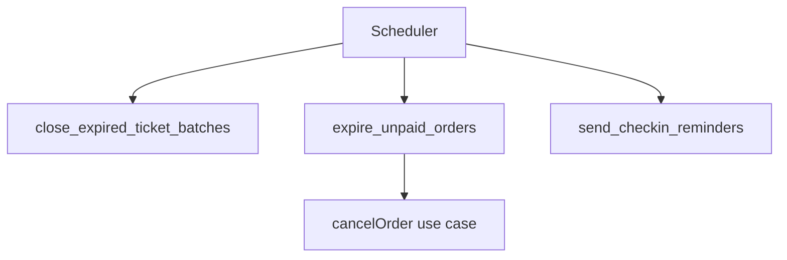

# Backend — Jobs Agendados

> [!abstract] Propósito
> Rotinas assíncronas e agendadas do domínio de eventos e ingressos. Pipeline em [[fluxos]]; regras em [[services]].

> [!warning] Estado atual
> ==Nenhum job implementado.== Não é requisito obrigatório do [[../../prd|PRD]] — entra apenas se sobrar tempo depois do CRUD, dos processos de negócio e dos relatórios. Tudo abaixo é ==previsto==.

## Infraestrutura

Sem servidor dedicado, um processo de longa duração (goroutine, worker) não existe. Jobs agendados são disparados pela própria Vercel:

| Item | Valor |
|---|---|
| Execução | Vercel Cron Jobs (`vercel.json`), que chama um Route Handler dedicado (ex.: `POST /api/jobs/expire-unpaid-orders`) no horário configurado |
| Autenticação do job | header/secret compartilhado, validado no Route Handler antes de rodar o use case |
| Banco | mesmo Postgres (Neon) da aplicação, via os mesmos repository ports |
| Timezone | `America/Sao_Paulo` |

## Requisitos de todo job

> [!danger] Obrigatório
> `idempotência` · `logs estruturados` · `tratamento de erro sem crash do processo`
>
> Reprocessar um job não pode duplicar cancelamento, notificação ou alterar duas vezes o mesmo lote.

## Jobs candidatos

| Job | Frequência | O que faz |
|---|---|---|
| `close_expired_ticket_batches` | A cada poucos minutos | Fecha lotes cuja `ends_at` já passou, evitando venda fora do período |
| `expire_unpaid_orders` | A cada poucos minutos | Cancela pedidos pendentes há mais tempo que o limite, devolvendo os ingressos ao lote — reusa `cancelOrder()`, ver [[services#cancelOrder]] |
| `send_checkin_reminders` | Diária, próximo à data do evento | Gera notificação/lembrete de check-in para participantes com ingresso emitido |

## Encadeamento

> [!important] Reaproveita os use cases existentes
> Nenhum job reimplementa regra de negócio: `expire_unpaid_orders` chama o mesmo use case `cancelOrder()` usado pela API e pela CLI — ver [[fluxos#Anatomia de uma requisição]].

## Falha e resiliência

Job que falhar retorna erro no Route Handler e loga a falha; o próximo disparo agendado do Vercel Cron tenta novamente no ciclo seguinte, sem afetar as demais rotas da aplicação.
