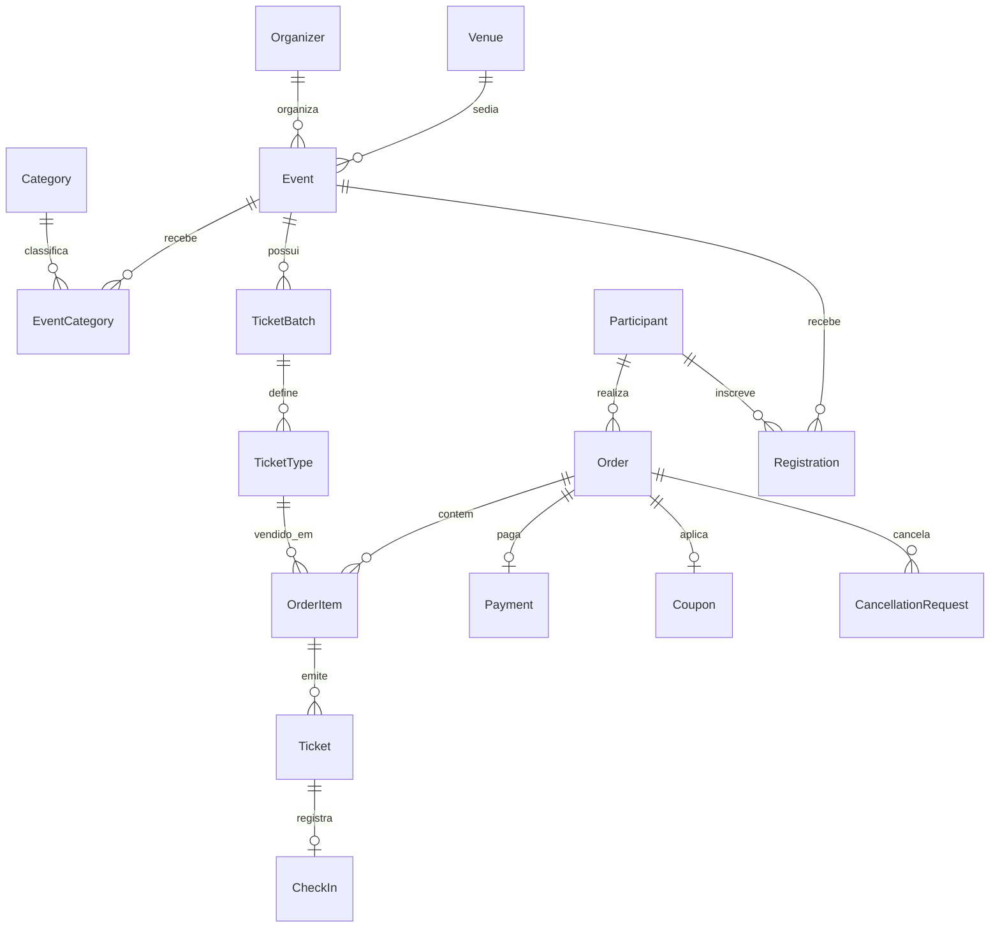

# Backend — Entidades

> [!abstract] Propósito
> Tabelas e relacionamentos por bounded context. Vocabulário de negócio em [[../glossario|Glossário]].

> [!danger] Documento superado
> **Este arquivo descreve o modelo PREVISTO antes da implementação e não é mais
> a fonte da verdade.** O modelo vigente está em:
>
> - [[../modelo-conceitual|Modelo Conceitual]] — entidades, relacionamentos, cardinalidades
> - [[../modelo-logico|Modelo Lógico]] — dicionário de dados completo
> - [[../modelo-mudancas|O que mudou]] — diferenças em relação a este documento e o porquê de cada uma
> - `db/schema.sql` — DDL executável
>
> Principais divergências: `ticket_batches` + `ticket_types` viraram uma tabela
> só (`lote`); `registrations` virou `inscricao` e passou a valer para todo
> ingresso, não só para eventos gratuitos; `participante` deixou de exigir
> conta; surgiram `cupom_evento`, `uso_de_cupom`, `dados_cobranca` e
> `dados_profissionais`. Os nomes passaram para português, acompanhando o
> restante do código.
>
> Mantido no repositório como registro histórico da modelagem inicial.

## Base

Todas as tabelas de entidade possuem `id UUID PK`, `created_at`, `updated_at`. Convenções: PK/FK sempre indexadas, `UNIQUE` e `CHECK` aplicados quando fizer sentido, sem JSONB substituindo relacionamento — ver [[guidelines]].

## Mapa de relacionamentos



## Identity

Responsável por usuários, organizadores e participantes. Autenticação é intencionalmente simples — ver [[../../prd|PRD]] seção 37.

### users
Conta de acesso ao sistema (login, e-mail). Base para `organizers` e `participants`.

### organizers
`id · user_id FK · name · document · contact_email · created_at`. Um organizador possui vários eventos.

### participants
`id · user_id FK · name · document · contact_email`. Um participante realiza pedidos e se inscreve em eventos.

## Event

Responsável por eventos, categorias, locais e ciclo de publicação.

### events
`id · organizer_id FK · venue_id FK NULL · name · description · modality (presencial|online|híbrido) · status (rascunho|publicado|encerrado|cancelado) · starts_at · ends_at · capacity · created_at`

> [!important] Regras de negócio
> Evento precisa de organizador. Evento online não exige local físico. Evento publicado precisa das informações mínimas preenchidas. Evento encerrado não recebe novas inscrições — ver [[services#publishEvent]].

### categories
`id · name UNIQUE`. Taxonomia reutilizável entre eventos.

### event_categories
Tabela associativa `event_id FK · category_id FK` — um evento pode ter várias categorias.

### venues
`id · name · address · city · capacity`. Local físico reutilizável entre eventos.

## Ticketing

Responsável por lotes, tipos de ingresso, pedidos, pagamentos e cupons.

```text
Evento → Lote → Tipo de ingresso
Participante → Pedido → Item do Pedido → Ingresso
```

### ticket_batches
`id · event_id FK · name · starts_at · ends_at · status (fechado|aberto|esgotado|encerrado)`. Um evento tem vários lotes; abrir/fechar lote é processo de negócio, não CRUD simples — ver [[services#openTicketBatch]].

### ticket_types
`id · ticket_batch_id FK · name · price · quantity_total · quantity_sold`. `quantity_sold <= quantity_total` é CHECK obrigatório para suportar a estratégia de concorrência da venda — ver [[fluxos#Concorrência]].

### orders
`id · participant_id FK · coupon_id FK NULL · status (pendente|confirmado|cancelado) · total_amount · created_at`

### order_items
Tabela associativa `order_id FK · ticket_type_id FK · quantity · unit_price` — item de um pedido, referenciando o tipo de ingresso comprado.

### tickets
`id · order_item_id FK · participant_id FK · status (emitido|cancelado|utilizado) · issued_at`. Emitido somente após `confirmOrder()` — ver [[services#issueTicket]].

### coupons
`id · code UNIQUE · discount_type · discount_value · valid_from · valid_until · usage_limit · usage_count`

### payments
`id · order_id FK · method · status (pendente|aprovado|recusado|estornado) · amount · paid_at`

## Participation

Responsável por inscrições, check-in e status de participação.

```text
Participante → Inscrição → Evento
Ingresso → Check-in
```

### registrations
Tabela associativa `participant_id FK · event_id FK · status (ativa|cancelada) · registered_at` — vincula participante a evento, distinto da compra de ingresso quando o evento tem inscrição própria (ex.: eventos gratuitos).

### check_ins
`id · ticket_id FK · checked_in_at · performed_by FK (users)`. Um check-in por ingresso — ver validações em [[services#checkInParticipant]].

### cancellation_requests
`id · order_id FK · reason · status (solicitado|aprovado|negado) · requested_at · resolved_at`
