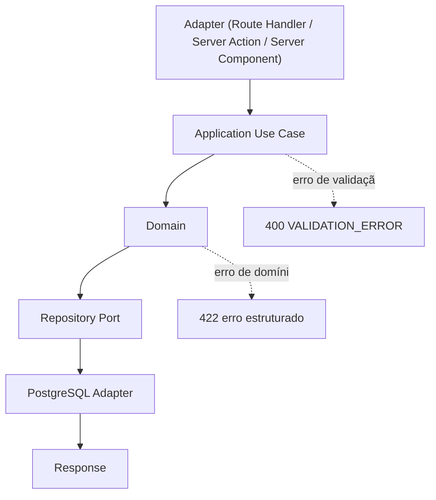
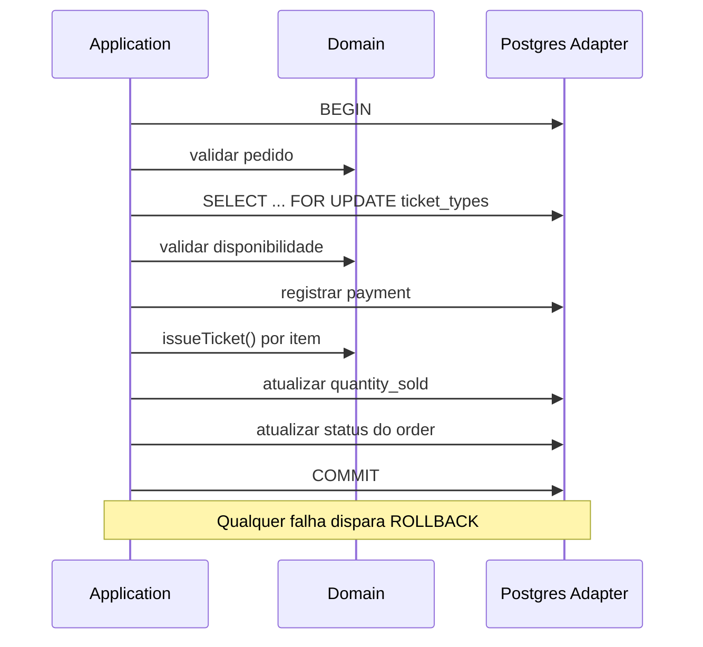
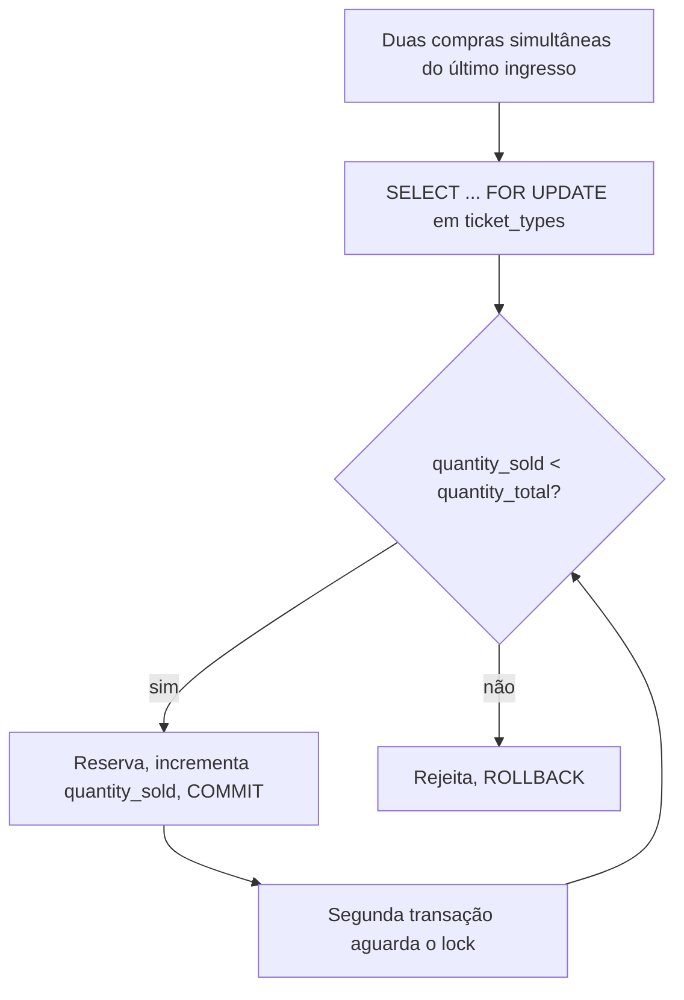
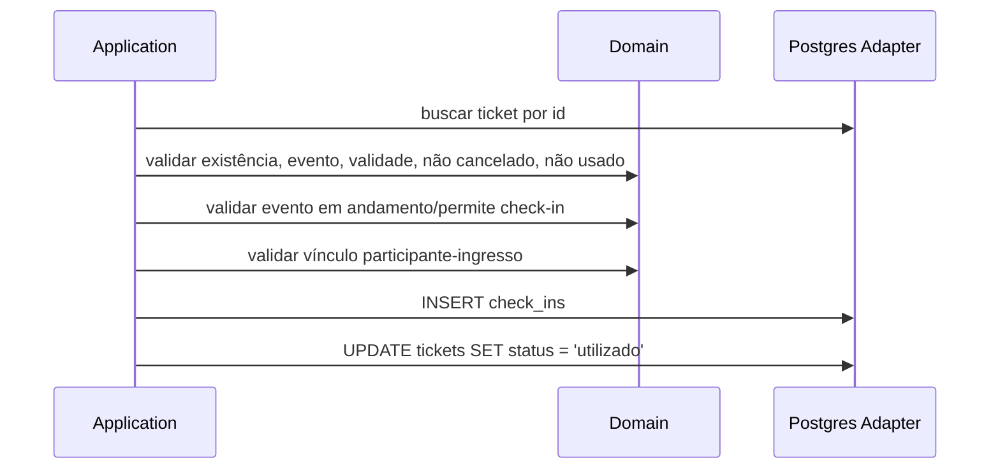
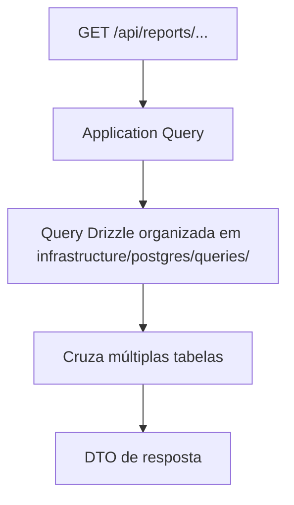
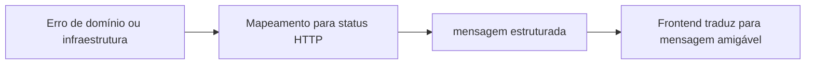

# Backend — Fluxos Técnicos

> [!abstract] Propósito
> Como as camadas do backend colaboram em cada operação. Fluxos de produto em [[../fluxos]]; use cases em [[services]].

> [!warning] Estado atual
> ==Nenhum fluxo implementado.== Tudo abaixo é ==previsto==.

## Anatomia de uma requisição

> [!danger] API não é domínio
> Nunca `Route Handler → SQL` nem `Route Handler → Repository` direto — o mesmo vale para Server Components e Server Actions. O fluxo sempre passa por `Application Use Case → Domain → Repository Port` — ver [[../../prd|PRD]] seção 22. A mesma cadeia de use cases é reutilizada pela [[api#CLI|CLI]], sem duplicar regra de negócio.

## Transações — `confirmOrder()`

Todo processo de negócio que altera múltiplas tabelas usa transação PostgreSQL explícita, obtida com `pool.connect()` e `BEGIN`/`COMMIT`/`ROLLBACK` manuais ao redor do use case — nunca queries "soltas" direto no pool compartilhado — ver [[services#confirmOrder]] e [[../../prd|PRD]] seção 12.

## Concorrência na venda de ingressos

> [!danger] Estratégia de concorrência
> Row-level locking via `SELECT ... FOR UPDATE` sobre `ticket_types` dentro da transação de `confirmOrder()`, combinado com `CHECK (quantity_sold <= quantity_total)` como segunda linha de defesa. Isso evita que duas compras concorrentes vendam o mesmo último ingresso — ver [[../../prd|PRD]] seção 13.

## Check-in

Validações detalhadas em [[services#checkInParticipant]].

## Relatórios

Query de relatório vive isolada por bounded context, nunca espalhada pelos handlers — ver [[manifesto#Regras de organização]].

## Tratamento de erro

Stack trace vai para log estruturado, ==nunca para a resposta== — ver [[../../prd|PRD]] seção 31.
