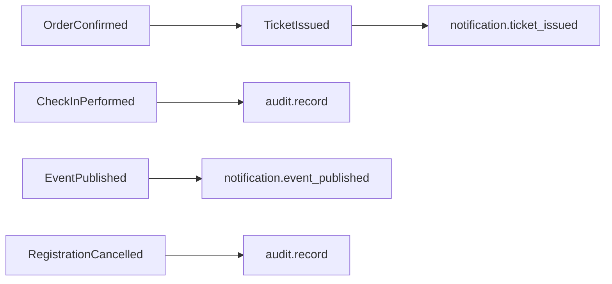

# Backend — Eventos de Domínio

> [!abstract] Propósito
> Eventos de domínio publicados por use cases e seus efeitos colaterais. Regras em [[services]]; agendamento em [[crons]].

> [!warning] Estado atual
> ==Nenhum evento de domínio implementado.== Tudo abaixo é ==previsto==.

## Quando usar evento de domínio — e quando não usar

> [!danger] Evento de domínio não é lugar de regra de negócio
> Eventos servem para **efeitos colaterais transversais**: auditoria, notificação, integração entre bounded contexts.
>
> Um fluxo transacional (validar → cobrar → emitir ingresso → atualizar estoque) pertence ao próprio use case em `application/`, onde o encadeamento é ==explícito, testável e ordenado dentro de uma transação== — ver [[fluxos#Transações]].

Preferir chamada explícita no use case. Publicar evento apenas quando o acoplamento direto entre bounded contexts for pior que a indireção — por exemplo, `ticketing` não deveria importar diretamente o pacote `participation`.

## Eventos previstos

| Evento | Publicado por | Consumido por |
|---|---|---|
| `OrderConfirmed` | `confirmOrder()` (ticketing) | `TicketIssued` em cascata |
| `TicketIssued` | `issueTicket()` (ticketing) | notificação ao participante, auditoria |
| `EventPublished` | `publishEvent()` (event) | notificação a interessados na categoria |
| `CheckInPerformed` | `checkInParticipant()` (participation) | auditoria, relatório de presença |
| `RegistrationCancelled` | `cancelRegistration()` (participation) | auditoria |

> [!important] Ordem e idempotência
> Reprocessar o mesmo evento não pode duplicar ingresso emitido nem notificação. `OrderConfirmed` e seus efeitos rodam dentro da mesma transação de `confirmOrder()` — ver [[fluxos#Transações]].

## Auditoria

Ações relevantes (`EventPublished`, `OrderConfirmed`, `OrderCancelled`, `CheckInPerformed`, `RegistrationCancelled`) são registradas explicitamente pelo use case correspondente, não por hook implícito do ORM — mantendo o domínio livre de infraestrutura, mesmo usando Drizzle para o acesso a dados.

## Registro

Cada bounded context expõe seus eventos de domínio como tipos simples em `domain/`, publicados pela camada `application/` após a transação ser confirmada. Handlers de efeito colateral (notificação, auditoria) vivem em `infrastructure/`, nunca em `domain/`.
