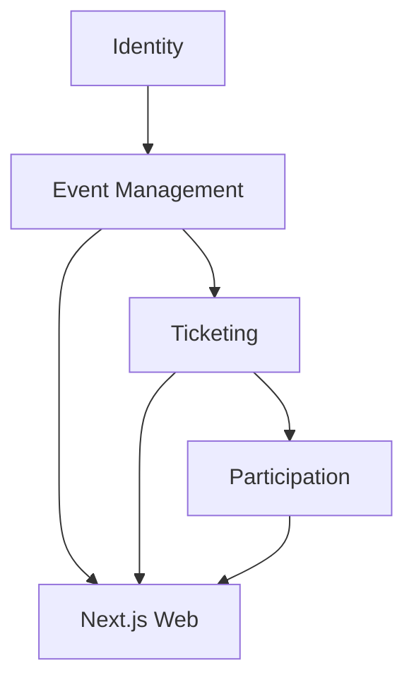
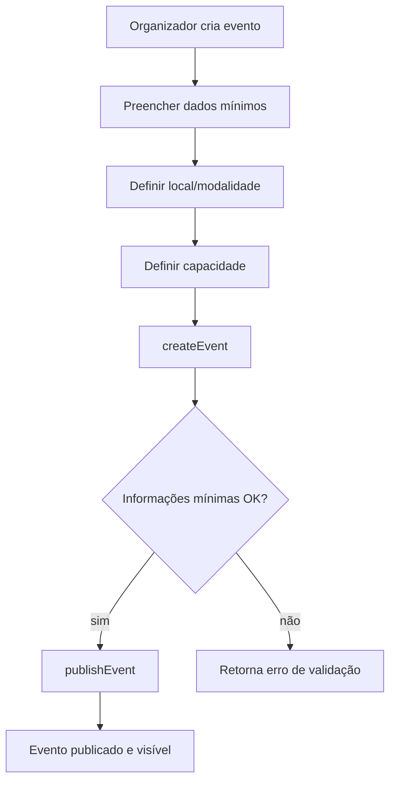
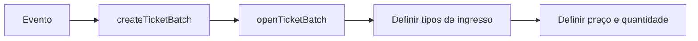
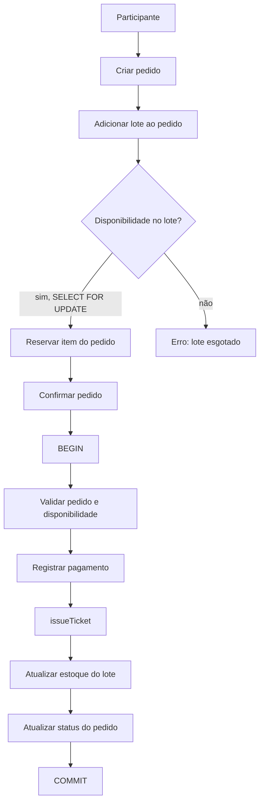
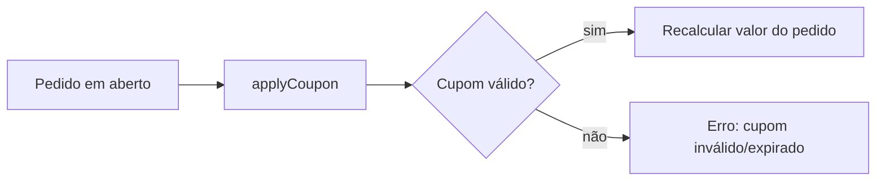
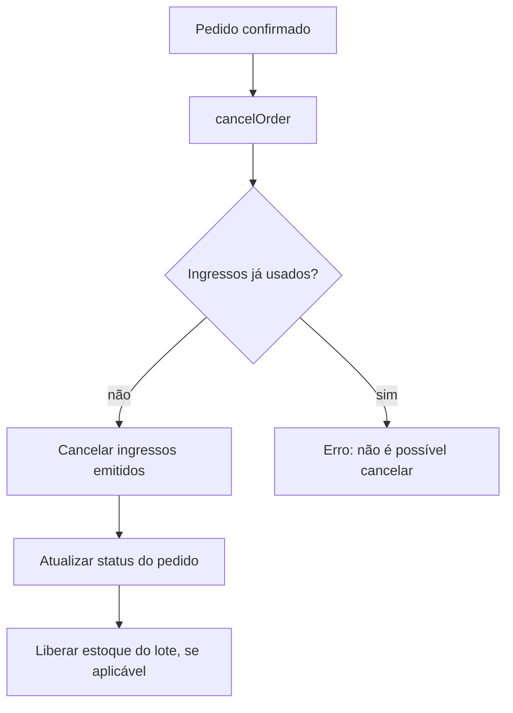
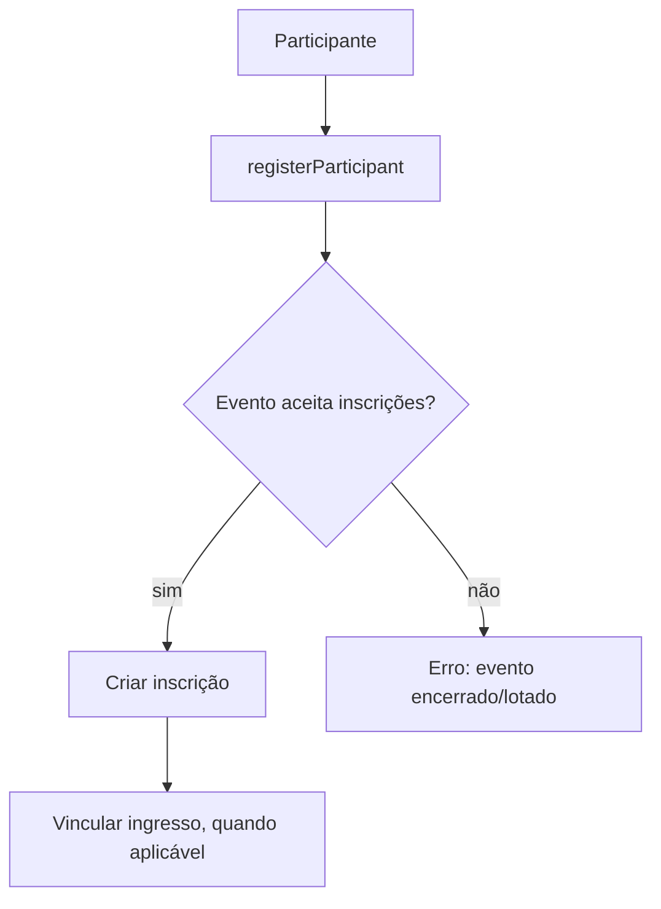
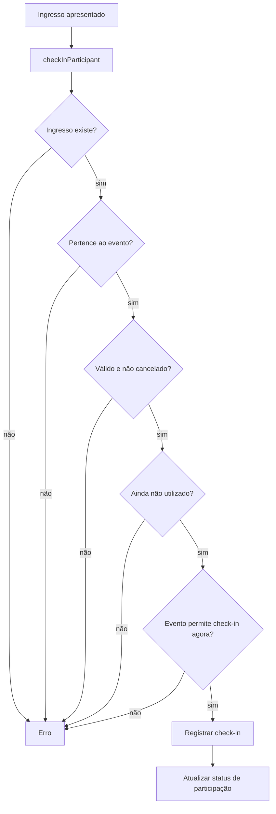
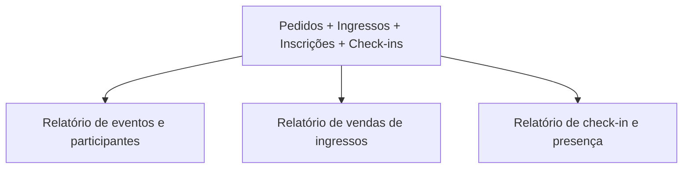

# Fluxos do Sistema

> [!abstract] Propósito
> Fluxos-chave de ponta a ponta, do ponto de vista do produto. Fluxos técnicos internos do backend estão em [[backend/fluxos]].

> [!note] Estado atual
> Os fluxos abaixo correspondem à implementação atual. As regras ficam nos
> casos de uso em `src/server/`; as páginas apenas adaptam a interface.

## Arquitetura funcional

## Criar e publicar evento

> [!important] Evento encerrado não recebe novas inscrições
> `publishEvent` valida campos mínimos; encerrar um evento bloqueia `registerParticipant` e `addTicketToOrder`. Ver [[backend/services#Event Management]].

## Criar lote e tipo de ingresso

## Comprar ingresso

> [!important] Consistência na venda
> A confirmação registra a venda dentro de transação no adapter PostgreSQL e
> mantém o preço congelado no item do pedido.

## Aplicar cupom

## Cancelar pedido

## Inscrever participante

## Check-in

> [!important] Check-in não é um simples INSERT
> Ele valida existência, vínculo ao evento, validade, uso prévio e janela do
> evento antes de registrar a presença.

## Relatórios

Cada relatório cruza múltiplas tabelas (nunca consulta uma única tabela isolada). Ver [[backend/api#Relatórios]].
