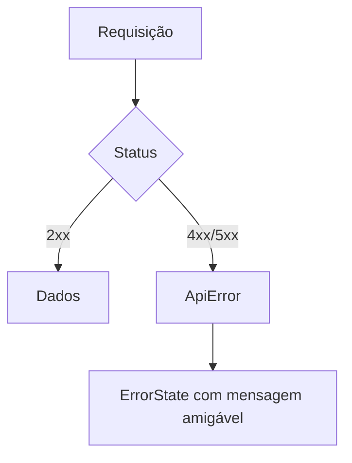

# Frontend — Gerenciamento de Estado

> [!abstract] Propósito
> Como o frontend busca, guarda e sincroniza dados. Rotas em [[paginas]]; contrato em [[../backend/api]].

> [!warning] Estado atual
> ==Nada implementado.== Não existe diretório `frontend/`, client HTTP nem camada de autenticação. Todo este documento descreve a abordagem ==prevista==.

## Princípio

> [!danger] O servidor é a fonte de verdade
> Disponibilidade de ingressos, status de pedido e regras de negócio ==vêm prontos do servidor== (use cases em `src/server/`). O frontend não recalcula regra de negócio — ver [[manifesto#Princípios]].

Três categorias, com ferramentas distintas:

| Categoria | Exemplo | Ferramenta |
|---|---|---|
| **Server state** | eventos, lotes, pedidos, relatórios | TanStack Query (ou fetch em Server Components) |
| **URL state** | filtros de relatório, paginação | search params |
| **UI state** | dialog aberto, item selecionado | `useState` local |

> [!tip] Filtros vivem na URL
> Torna a visão compartilhável e evita um store global desnecessário.

## Client HTTP

`src/lib/api-client.ts` — wrapper simples sobre `fetch`, usado **apenas** por componentes client-side:

- Caminhos relativos same-origin (`/api/...`); não existe base URL externa nem `NEXT_PUBLIC_API_URL`.
- Server Components e Server Actions não passam por ele: chamam os use cases diretamente.
- Normaliza erros da API (status HTTP + mensagem) em uma classe `ApiError`.
- Autenticação, quando existir, é opcional e simples (PRD seção 37) — não deve consumir esforço significativo do frontend.



## Query keys previstas

```ts
['events', filtros]
['event', id]
['ticket-batches', eventId]
['orders', filtros]
['tickets', filtros]
['reports', 'events', filtros]
['reports', 'sales', filtros]
['reports', 'check-ins', filtros]
```

## Hooks por domínio

`src/hooks/` deve expor um hook por recurso — `useEvents`, `useEvent`, `useOrders`, `useTickets`, `useReports`.

> [!important] Componentes não chamam o client diretamente
> Eles consomem hooks, mantendo query keys e invalidação em um lugar só.

## Mutações e invalidação

| Ação | Invalida |
|---|---|
| Publicar evento | `['event', id]`, `['events', ...]` |
| Criar/abrir lote de ingressos | `['ticket-batches', eventId]` |
| Confirmar pedido | `['orders', ...]`, `['tickets', ...]` |
| Realizar check-in | `['tickets', ...]`, relatório de check-in |

Feedback simples via toast ou mensagem inline. Sem optimistic update em operações que envolvem disponibilidade de ingresso — a confirmação do servidor é obrigatória, já que o backend controla concorrência na venda (ver [[../backend/services]]).

## Estados de carregamento

Toda página trata explicitamente loading, lista vazia e erro. Ver [[componentes#Estados]].

## Performance

Paginação server-side nas listagens (pedidos, ingressos, participantes) para evitar carregar volumes grandes no browser.
