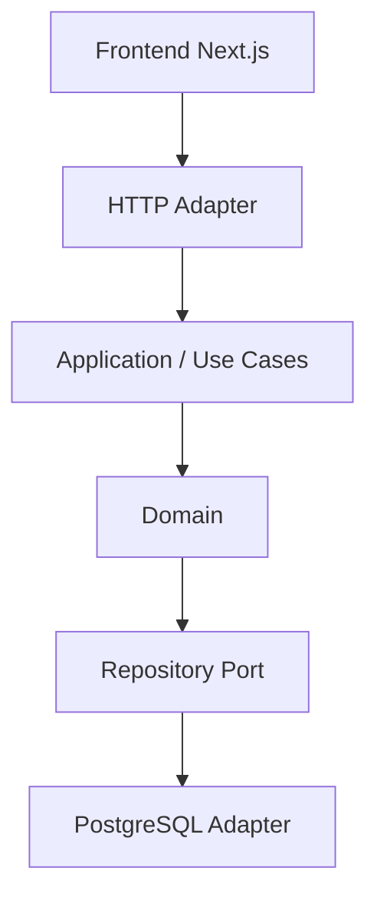

# Guidelines de Desenvolvimento

> [!abstract] Propósito
> Convenções obrigatórias do Ducktix. Em caso de conflito, o [[PRD]] prevalece. Princípios de produto em [[manifesto]].

## Camadas



> [!danger] Regra única e inegociável
> `Domain` ==nunca== conhece PostgreSQL, HTTP, JSON, chi/net-http ou Next.js. Dependency Inversion sempre: `Domain ← Application ← Ports ← Adapters`.

| Onde vive | O quê |
|---|---|
| `internal/<contexto>/domain/` | Entities, value objects, regras de negócio, domain errors. Sem infraestrutura. |
| `internal/<contexto>/application/` | Use cases, commands, queries, orquestração. Chama ports, nunca SQL direto. |
| `internal/<contexto>/ports/` | Interfaces de repositório e serviços externos. |
| `internal/<contexto>/adapters/` | Implementação PostgreSQL, handlers HTTP, comandos CLI. |
| `internal/shared/` | Código realmente compartilhado entre bounded contexts (ex.: erros comuns, tipos de valor genéricos). Não vira `utils` genérico. |

Pergunte sempre: **"essa regra pertence a qual bounded context?"**

| Regra | Bounded Context |
|---|---|
| Usuário, organizador, participante | `identity` |
| Evento, categoria, local, publicação | `event` |
| Lote, tipo de ingresso, pedido, cupom, pagamento | `ticketing` |
| Inscrição, check-in, cancelamento | `participation` |

Estrutura concreta em [[backend/manifesto]] e [[frontend/manifesto]].

## Segurança

> [!danger] Obrigatório, sem exceção
> - SQL sempre parametrizado (`pgx`). **Nunca** concatenar entrada do usuário em query.
> - Credenciais de banco ficam em `.env`, nunca versionadas nem hardcoded.
> - Autorização é implementada no backend, não apenas ocultando botão no frontend.
> - Regra de negócio crítica (ex.: "não vender ingresso de lote esgotado") vive no domínio, nunca só no frontend.
> - CORS configurado adequadamente na API.
> - Autenticação pode ser simples — o foco do projeto é banco de dados, Go e arquitetura, não segurança avançada.

## Erros

O backend retorna erro estruturado, sem stack trace para o usuário:

```json
{ "code": "TICKET_BATCH_SOLD_OUT", "message": "Lote de ingressos esgotado", "details": {} }
```

Erros de domínio (ex.: `ErrTicketBatchSoldOut`, `ErrCheckInAlreadyDone`) são distintos de erros de infraestrutura, e cada um mapeia para um HTTP status apropriado no adapter HTTP.

## Concorrência na venda de ingressos

> [!important] Ponto crítico do projeto
> `confirmOrder` deve rodar em transação com `SELECT ... FOR UPDATE` sobre a linha do lote/tipo de ingresso, garantindo que duas compras simultâneas nunca vendam o mesmo último ingresso. Explicar a estratégia em ADR-006. Ver [[fluxos#Comprar ingresso]] e [[backend/fluxos#Concorrência]].

## Transações

Todo processo de negócio que altera múltiplas tabelas usa transação explícita (`BEGIN`/`COMMIT`/`ROLLBACK`), por exemplo `confirmOrder` (pagamento + emissão de ingressos + atualização de estoque + status do pedido). Ver [[backend/services]].

## Modelagem e normalização

- Esquema normalizado até a 3FN: evitar redundância, dependência transitiva e atributos multivalorados.
- Tabelas associativas usadas corretamente (ex.: `event_categories`, `order_items`).
- PKs, FKs, `UNIQUE`, `CHECK` e `NOT NULL` aplicados de forma consistente.
- `JSONB` só com justificativa real — nunca para substituir relacionamento.
- Toda alteração de schema é feita via migration (`golang-migrate`), nunca via `docker-entrypoint-initdb.d`.

## Go idiomático

- `context.Context` propagado em toda operação de aplicação e repositório.
- Interfaces pequenas (ports), definidas onde são consumidas, não onde são implementadas.
- Erros explícitos, `errors.Is`/`errors.As`, sem panics para controle de fluxo.
- Dependency injection manual e simples — sem framework de DI.
- `pgx`/`pgxpool` para acesso a PostgreSQL, sem ORM pesado.
- Evitar: frameworks gigantes, "repository" genérico universal, interfaces criadas sem necessidade, reflection, abstrações que só existem para "seguir DDD".

## Mocks e dados de demonstração

Seeds devem ser realistas (múltiplos eventos, organizadores, participantes, lotes, pedidos, pagamentos, check-ins, cupons) — nunca `Evento 1`, `Pessoa 1`. Ver [[backend/manifesto#Seeds]].

## Performance

Queries indexadas (`event_id`, `organizer_id`, `participant_id`, `order_id`, status, timestamps) · paginação em listagens · queries de relatório organizadas em arquivos dedicados (`queries/`), fáceis de identificar.

## Testes

| Camada | O que testar |
|---|---|
| Domain | regras de negócio: evento sem info obrigatória, publicação inválida, venda com lote encerrado/esgotado, check-in duplicado ou de ingresso cancelado, cancelamento inválido |
| Integração | fluxos críticos: comprar ingresso, confirmar pedido, check-in, concorrência de venda |
| Relatórios | queries de relatório com múltiplas tabelas |

## Convenções de código

**Backend** — Go idiomático, `internal/` por bounded context com `domain/application/ports/adapters`, `cmd/api` e `cmd/cli` como entrypoints, migrations versionadas.

**Frontend** — TypeScript, Next.js App Router, componentes reutilizáveis, sem regra de negócio crítica no cliente.

**Commits** — mensagens claras em português, descrevendo o processo de negócio ou entidade afetada.

## Definition of Done

> [!success] Uma funcionalidade só está pronta quando
> Domínio + aplicação + adapter PostgreSQL + adapter HTTP/CLI + frontend funcionam de ponta a ponta; regra de negócio testada; transação/concorrência tratada quando aplicável; documentação (`docs/`) atualizada.

## Antipadrões

> [!failure] Não faça
> Microserviços, ORM pesado sem justificativa, regra de negócio no handler HTTP ou no frontend, `utils`/`helpers` genérico contendo tudo, abstração que só existe para "seguir DDD" sem agregar valor.

> [!failure] Não entregue
> CRUD simples de eventos sem processos de negócio reais, relatórios de tabela única, tabelas artificiais só para aumentar a nota, venda de ingresso sem controle de concorrência.
