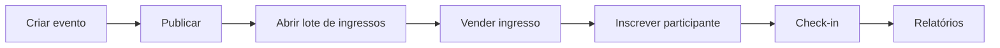

# Manifesto — Ducktix

> [!abstract] Propósito deste documento
> Visão geral, escopo e propósito do produto. A fonte de verdade do produto é o [[PRD]].

## O que é

O **Ducktix** é um **sistema de gestão de eventos, ingressos e participantes**. Ele administra o ciclo completo de criação, publicação, venda, inscrição e participação em eventos — presenciais, online ou híbridos.

Este projeto é acadêmico (disciplina de Banco de Dados) e tem um objetivo secundário: servir como projeto de aprendizado de **TypeScript full stack com Next.js**.

## O problema

Organizar um evento envolve múltiplos processos interdependentes que precisam de consistência forte:

- Quantos ingressos de cada tipo/lote ainda estão disponíveis?
- Como evitar vender o último ingresso duas vezes em compras simultâneas?
- Quem já fez check-in e quem ainda não compareceu?
- Qual a receita e a ocupação real de cada evento?
- Como cancelar um pedido ou uma inscrição sem deixar o banco inconsistente?

## Posicionamento

> [!important] O Ducktix não é "um CRUD de eventos"
> É uma exploração completa do domínio de eventos, com entidades, relacionamentos, processos de negócio, transações e relatórios que demonstram domínio real de banco de dados.

A evolução pretendida do domínio:

`ENTIDADES → RELACIONAMENTOS → PROCESSOS DE NEGÓCIO → TRANSAÇÕES → REGRAS DE NEGÓCIO → RELATÓRIOS`

## Princípios inegociáveis

| Princípio | Significado prático |
|---|---|
| **Domínio não conhece infraestrutura** | O domínio não pode depender de PostgreSQL, HTTP, JSON ou Next.js. Ver [[guidelines]]. |
| **Sem microserviços** | Monólito full stack em um único projeto Next.js, com bounded contexts como pastas — não serviços distribuídos, não backend separado. |
| **Processos de negócio explícitos** | Toda tabela associativa relevante precisa de uma operação de negócio, não apenas CRUD. |
| **Concorrência controlada** | Venda de ingressos usa transação + `SELECT ... FOR UPDATE` para nunca vender o mesmo ingresso duas vezes. |
| **REST não é a interface final** | A interface final é o frontend Next.js; a API é um adaptador de entrada. |
| **SQL explícito** | Drizzle ORM usado como query builder tipado, não como ORM mágico — queries legíveis e parametrizadas, organizadas por bounded context. |
| **Migrations, nunca init scripts** | Toda alteração de schema passa por migration versionada. |

As convenções que materializam esses princípios estão em [[guidelines]].

## Escopo do MVP (Fase 1)

> [!success] Dentro do escopo
> Eventos (presenciais/online/híbridos) · organizadores · locais · categorias · lotes de ingressos · tipos de ingresso · pedidos e itens de pedido · pagamentos · cupons · participantes · inscrições · check-in · cancelamentos · relatórios (eventos/participantes, vendas, check-in/presença) · API REST · frontend Next.js · CLI mínima.

> [!failure] Fora do escopo
> Banco de dados NoSQL (fica para a Fase 2) · microserviços · autenticação sofisticada · app mobile · design visual sofisticado · automações de marketing.

A arquitetura (ports/adapters) deve permitir a adaptação para NoSQL na Fase 2 sem reescrever regras de negócio.

## Arquitetura

**DDD + Arquitetura Hexagonal + Monólito Modular**, com bounded contexts:

- **Identity** — usuários, organizadores, participantes.
- **Event** — eventos, categorias, locais, publicação, capacidade.
- **Ticketing** — lotes, tipos de ingresso, pedidos, cupons, pagamentos.
- **Participation** — inscrições, ingressos emitidos, check-in.

Stack: **Next.js (App Router)** em TypeScript strict contendo frontend e backend no mesmo projeto — Route Handlers e Server Actions como adaptadores de entrada, **Drizzle ORM** (`drizzle-kit` para migrations) sobre **PostgreSQL** no **Neon** via `@neondatabase/serverless`, deploy único na **Vercel**, e uma **CLI** mínima (`tsx`) reutilizando os mesmos use cases.

## Estado atual do projeto

> [!warning] Nenhum código de produto foi escrito ainda
> Este documento registra decisões de arquitetura tomadas no início do projeto.
> O estado implementado está em [[estado-atual]] e no código-fonte.

| Fase | Status |
|---|---|
| Discovery (domínio, entidades, bounded contexts) | 📋 Previsto |
| Modelagem (DER, esquema lógico, dicionário de dados) | 📋 Previsto |
| Infraestrutura (Postgres local, migrations, seeds, backup) | 📋 Previsto |
| Backend em `src/server/` (domain → application → ports → infrastructure) | 📋 Previsto |
| Frontend (`src/app/`) | 📋 Previsto |
| Testes | 📋 Previsto |
| Documentação final (`docs/fase-1.md`, ADRs) | 📋 Previsto |

## Mapa da documentação

- [[funcionalidades]] — catálogo de features previstas e implementadas
- [[guidelines]] — convenções de desenvolvimento
- [[fluxos]] — fluxos-chave do sistema
- [[glossario]] — termos de domínio do negócio
- [[backend/manifesto|Backend — Manifesto]] · [[backend/entidades|Entidades]] · [[backend/api|API]] · [[backend/services|Services]] · [[backend/signals|Signals]] · [[backend/crons|Crons]] · [[backend/fluxos|Fluxos técnicos]]
- [[frontend/manifesto|Frontend — Manifesto]] · [[frontend/componentes|Componentes]] · [[frontend/paginas|Páginas]] · [[frontend/estado|Estado]] · [[frontend/history-book|History Book]]
