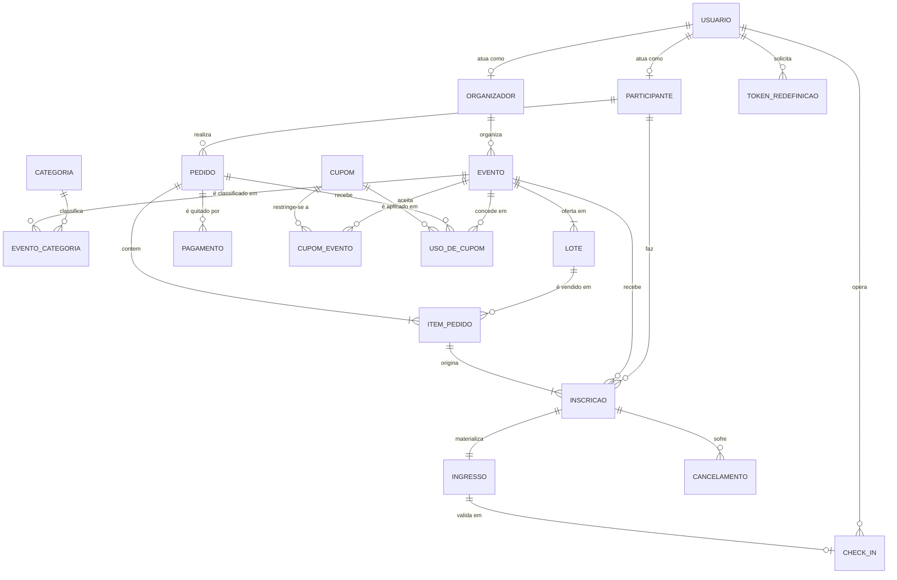

# Modelo Conceitual — Ducktix

> [!abstract] Propósito
> Esquema conceitual do domínio, no nível de entidades, relacionamentos e
> cardinalidades — sem tipos de coluna nem detalhe físico. É o item **(b)** do
> documento de entrega da Fase 1. O detalhamento físico está em
> [[modelo-logico|Modelo Lógico]]; o que mudou em relação ao modelo previsto
> antes da implementação está em [[modelo-mudancas]].

## 1. O domínio

Ducktix administra o ciclo completo de um evento: um **organizador** cria um
**evento**, define **lotes** de ingresso com preço e vagas, publica o evento,
e o **participante** compra ingressos num **pedido**, opcionalmente com
**cupom** de desconto. Confirmado o **pagamento**, o sistema emite um
**ingresso** por vaga comprada e registra a **inscrição** do participante no
evento. No dia, a inscrição vira presença por meio do **check-in**.

O domínio tem três processos que não são cadastro, e é neles que a modelagem
precisa ser precisa:

1. **Venda com concorrência** — dois participantes não podem comprar a mesma
   vaga. O contador de vendidos por lote é a linha travada na transação.
2. **Emissão de ingresso** — um pedido confirmado gera N inscrições e N
   ingressos, um por unidade comprada, e cada ingresso pode ser nominal a
   alguém diferente de quem pagou.
3. **Check-in** — presença é um fato datado, distinto de "estar inscrito".
   Inscrito sem check-in é o *no-show*, e é justamente o que o relatório de
   presença precisa mostrar.

## 2. Diagrama entidade-relacionamento

## 3. Entidades

### 3.1 Contexto: Identidade

| Entidade | Descrição | Atributos principais |
|---|---|---|
| **USUARIO** | Conta de acesso. Um usuário é organizador **ou** participante — o papel decide a que área do sistema ele entra. | nome, e-mail (único), senha (hash), papel, CPF/CNPJ, foto |
| **ORGANIZADOR** | Especialização de usuário que publica eventos. Guarda os dados de quem responde pelo evento. | nome fantasia, documento, e-mail de contato |
| **PARTICIPANTE** | Pessoa que ocupa uma vaga. **Não exige conta**: um comprador pode emitir ingresso nominal para terceiros, então o participante existe mesmo sem usuário associado. Carrega também os dados profissionais opcionais coletados no checkout (networking). | nome, sobrenome, e-mail, celular, nome no crachá, LinkedIn, GitHub, empresa, segmento, cargo, nível |
| **TOKEN_REDEFINICAO** | Token temporário de redefinição de senha. | token, expira em |

### 3.2 Contexto: Eventos

| Entidade | Descrição | Atributos principais |
|---|---|---|
| **EVENTO** | A unidade central do domínio. Tem ciclo de vida próprio (rascunho → publicado → encerrado/cancelado) e visibilidade (público / não listado). O local é texto livre no próprio evento — não há cadastro de locais reutilizáveis nesta fase. | slug, nome, descrição, local, modalidade, formato online, status, visibilidade, início, término, imagem |
| **CATEGORIA** | Taxonomia reutilizável (Tecnologia, Música, Esporte…). | nome (único), slug |
| **LOTE** | Faixa de ingresso à venda dentro de um evento: preço, vagas e prazo. É onde a venda acontece e onde a concorrência é resolvida. Um evento tem **no mínimo um** lote. | nome, preço, vagas, vendidos, encerra em, ordem |

### 3.3 Contexto: Vendas (ticketing)

| Entidade | Descrição | Atributos principais |
|---|---|---|
| **PEDIDO** | O carrinho e a compra são a mesma entidade em estados diferentes: pedido `aberto` é carrinho; `confirmado` é compra. Guarda a reserva temporária das vagas e os dados de cobrança do comprador (CPF e endereço), preenchidos na etapa 1 do checkout. | status, criado em, reservado até, confirmado em, CPF e endereço de cobrança |
| **PAGAMENTO** | Tentativa de quitação do pedido, com método e status próprios. Um pedido pode ter mais de um pagamento (recusa seguida de nova tentativa). | método, status, valor, código externo, pago em |
| **CUPOM** | Código de desconto, percentual ou fixo, com janela de validade e limite de uso. | código (único), tipo, valor, válido de/até, limite, usos, ativo |

### 3.4 Contexto: Participação

| Entidade | Descrição | Atributos principais |
|---|---|---|
| **INGRESSO** | O documento emitido, com o código que vira QR na entrada. Existe **um por inscrição**. | código (único), status, emitido em |
| **CHECK_IN** | Registro datado da entrada do participante no evento, feito por um operador. Um por ingresso. | realizado em, operador |
| **CANCELAMENTO** | Pedido de cancelamento de uma inscrição, com motivo e trâmite próprio. | motivo, status, solicitado em, resolvido em |

## 4. Tabelas associativas e seus processos de negócio

> [!important] Requisito da disciplina
> Toda tabela associativa precisa de um **processo de negócio**, não de um CRUD
> genérico. Estas são as seis do domínio e a operação que as cria.

| Associativa | Relaciona | Processo de negócio |
|---|---|---|
| **EVENTO_CATEGORIA** | evento × categoria | *Classificar evento* — define em que trilhas da vitrine o evento aparece. |
| **ITEM_PEDIDO** | pedido × lote | *Adicionar ao carrinho* — valida se o lote está aberto, congela o preço unitário e reserva as vagas por 30 min. |
| **USO_DE_CUPOM** | cupom × pedido × evento | *Aplicar cupom* — valida janela, limite e restrição por evento; no fechamento rateia o desconto entre os eventos do pedido. |
| **CUPOM_EVENTO** | cupom × evento | *Restringir campanha* — limita um código a eventos específicos; ausência de linhas significa "vale em todos". |
| **INSCRICAO** | participante × evento (× item de pedido) | *Emitir ingresso* — na confirmação do pedido, cria uma inscrição por unidade comprada, nominal ao participante informado. |
| **CHECK_IN** | ingresso × usuário operador | *Realizar check-in* — valida que o ingresso está emitido, que é do evento certo e que ainda não foi usado; então marca presença. |

## 5. Cardinalidades e regras de participação

| Relacionamento | Cardinalidade | Participação |
|---|---|---|
| ORGANIZADOR — EVENTO | 1 : N | Evento **obrigatoriamente** tem organizador |
| EVENTO — LOTE | 1 : N | Evento tem **pelo menos um** lote (participação total) |
| EVENTO — CATEGORIA | N : N | Via `EVENTO_CATEGORIA`; ao menos uma categoria |
| PARTICIPANTE — PEDIDO | 1 : N | Pedido tem **um** comprador |
| PEDIDO — ITEM_PEDIDO | 1 : N | Pedido confirmado tem **pelo menos um** item |
| LOTE — ITEM_PEDIDO | 1 : N | Item aponta **exatamente um** lote |
| PEDIDO — PAGAMENTO | 1 : N | Pedido aberto pode ter **zero** pagamentos |
| ITEM_PEDIDO — INSCRICAO | 1 : N | Uma inscrição por unidade de `quantidade` |
| INSCRICAO — INGRESSO | 1 : 1 | Toda inscrição materializa **um** ingresso |
| INGRESSO — CHECK_IN | 1 : 0..1 | No máximo um check-in por ingresso |

## 6. Regras de negócio que o modelo precisa sustentar

1. **Não vender vaga inexistente.** `lote.vendidos <= lote.vagas` é uma
   restrição de verificação, e o incremento acontece dentro da transação de
   confirmação do pedido, com travamento da linha do lote.
2. **O preço é histórico.** `item_pedido.preco_unitario` guarda o preço no
   momento da compra. Se o organizador reajustar o lote depois, o pedido antigo
   não muda de valor.
3. **Ingresso não precisa ser do comprador.** Por isso `PARTICIPANTE` é
   entidade separada de `USUARIO` e a inscrição aponta para o participante, não
   para quem pagou.
4. **Reserva expira.** `pedido.reservado_ate` limita em 30 minutos o tempo que
   um carrinho segura vagas; expirado, o pedido é cancelado e as vagas voltam.
5. **Check-in só depois do evento começar.** Presença é fato do dia; antes
   disso, todo ingresso válido está apenas `emitido`.
6. **Cupom sem restrição vale em tudo.** Ausência de linhas em `CUPOM_EVENTO`
   significa campanha geral — evita ter que listar todos os eventos para dizer
   "todos".
7. **Evento publicado exige mínimo.** Nome, categoria, período, ao menos um
   lote e local (quando não for online).
8. **Local é texto livre.** Evento presencial e híbrido exigem `local`
   preenchido; evento online exige `local` nulo — restrição garantida no banco.

## 7. Relação com outros documentos

- [[modelo-logico|Modelo Lógico]] — dicionário de dados, tipos, chaves e normalização.
- [[modelo-mudancas]] — o que mudou em relação ao modelo previsto antes da implementação.
- [[glossario|Glossário]] — vocabulário de negócio.
- [[backend/entidades|Entidades]] — visão por bounded context no código.
